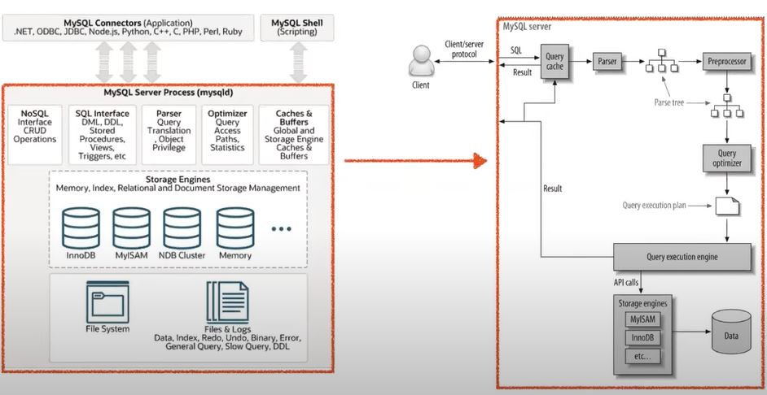
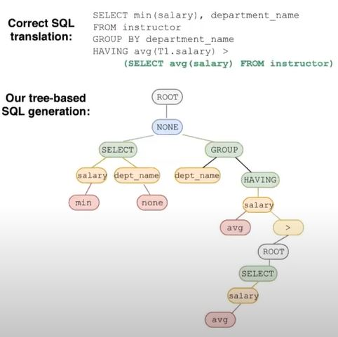
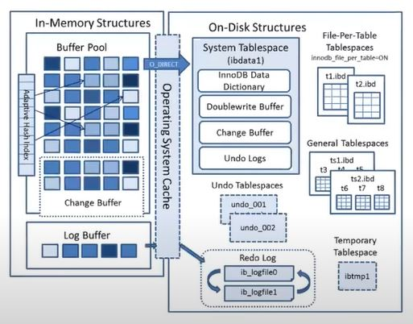
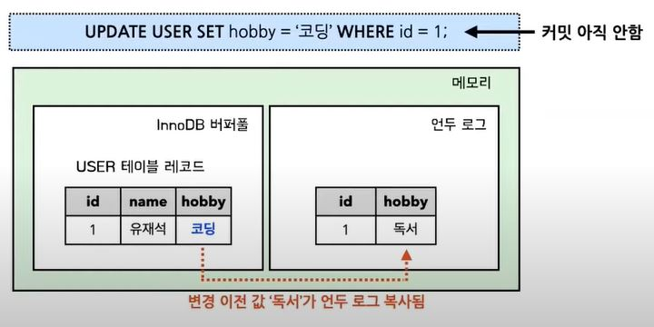
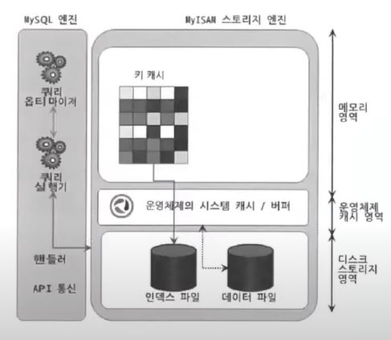

# MySql 아키텍처


MySql 아키텍처는 크게 4가지로 구분할 수 있습니다.

- __MySql 접속 클라이언트__
  - MySQL Connectors
  - MySQL Shell
  - MySQL 은 대부분의 프로그래밍 언어에 대해 접속 API 를 제공한다. 그리고 Shell 에서도 Script 를 통해 MySQL 에 접속할 수 있다.
- __MySQL 엔진__ : MySQL 의 두뇌
  - 쿼리 파서
  - 전처리기
  - 옵티마이저
    - 요청된 SQL 문을 최적화하여 실행시키기 위해 실행 계획을 짜는 중요한 역할을 한다.
    - MySQL 엔진을 두뇌에 비유한 이유는 이 옵티마이저 때문이다.
  - 실행 엔진
- __MySQL 스토리지 엔진__
  - 스토리지 엔진은 데이터를 실제로 디스크에 저장하거나, 디스크에 저장된 데이터를 읽어오는 역할을 담당한다.
  - MySQL 엔진은 옵티마이저가 작성한 실행 계획에 따라서 스토리지 엔진을 적절히 호출해서 쿼리를 실행한다.
  - MySQL 엔진이 스토리지 엔진을 호출할 때 사용하는 API 를 `핸들러 API` 라고 한다.
  - 핸들러 API 를 직접 구현하여 나만의 스토리지 엔진을 추가할 수도 있다.
- __운영체제, 하드웨어__
  - 실제 테이블의 데이터와 로그 데이터를 파일로 저장하는 역할을 담당한다.

## 쿼리 실행 과정



- __쿼리 캐시(Query Cache)__
  - 클라이언트가 SQL 요청을 MySQL 로 보내면 가장 먼저 `쿼리 캐시(Query Cache)` 를 만난다.
  - SQL 실행 결과를 메모리에 캐싱하는 역할
  - 동일 SQL 실행시 이전 결과 즉시 반환
  - 테이블의 데이터가 변경되면 캐싱된 데이터 삭제 필요(동시 처리 성능 저하)
      - 더 이상 쓸모 없어지게 된 캐싱 데이터를 삭제할 때마다 쿼리 캐시에 접근하는 쓰레드에 Lock 이 걸리는데 이는 심각한 동시 처리 성능 저하를 유발한다.
  - Mysql 8.0 부터 완전히 제거됨
- __쿼리 파서(Query Parser)__
  - 쿼리 파서는 기본적인 SQL 문장 오류를 체크한다.
  - SQL 문장을 토큰으로 쪼개서 트리로 만듦
  - 쿼리 파서는 `Parse Tree` 를 만든다.
  


MySQL 은 이 Parse Tree 를 사용하여 쿼리를 실행한다.

- __전처리기(Preprocessor)__
  - 전처리기는 쿼리 파서가 만든 Parse Tree 를 기반으로 쿼리 문장에 구조적인 문제점이 있는지 검사한다.
  - Parse Tree 를 기반으로 SQL 문장 구조를 체크
  - Parse Tree 의 토큰을 하나씩 검사하면서, 토큰에 해당하는 테이블 이름이나 컬럼 등이 실제로 존재하는 값인지 체크하고, 접근 권한에 대해서도 체크한다.
- __옵티마이저(Optimizer)__
  - SQL 을 최적화해서 실행 계획을 수립한다.
  - `규칙 기반 최적화`
    - 옵티마이저에 내장된 우선순위에 따라 실행 계획 수립
  - `비용 기반 최적화`
    - 작업의 비용과 대상 테이블의 통계 정보를 활용해서 실행 계획 수립
- __쿼리 실행 엔진(Query Execution Engine)__
  - 옵티마이저가 만든 실행 계획대로 스토리지 엔진을 호출해서 쿼리를 실행하는 역할을 담당한다.
- __스토리지 엔진(Storage Engine)__
  - 쿼리 실행 엔진이 요청한대로, 데이터를 디스크에 저장하거나 디스크로부터 데이터를 읽어온다.
  - 핸들러 API 에 의해 동작
  - 핸들러라고도 불림
  - 플러그인 형태로 제공되기 때문에 사용자는 원하는 스토리지 엔진을 선택하여 사용할 수 있다.
    - 그 밖에도 검색어 파서, 사용자 인증 모듈 등의 플러그인도 존재 한다. 하지만 플러그인 끼리는 통신할 수 없다. 플러그인은 MySQL 서버의 변수나 함수를 직접 호출하기 때문에 캡슐화를 위반한다는 단점도 있다. 그래서 MySQL 8.0 부터는 이러한 플러그인 아키텍처를 보완한 `컴포넌트 아키텍처`를 제공하게 되었다.
  - 대표적으로 `InnoDB`, `MyISAM` 스토리지 엔진이 있다.

## InnoDB 스토리지 엔진

- __InnoDB 아키텍처__



- __프라이머리 키(Primary Key)에 의한 클러스터링__
  - PK 순서대로 레코드를 디스크에 저장하는 것을 뜻한다.
  - PK 인덱스 자동 생성
    - PK 를 생성하지 않으면 InnoDB 가 알아서 생성해주는데, 이 생성된 PK 값을 사용자가 사용할 수 없으므로 직접 PK 를 생성해주는 것이 좋다.
  - PK 를 통해서만 레코드에 접근 가능
  - PK 를 통한 범위 검색이 매우 빠름
  - But 클러스터링 때문에 쓰기 성능 저하(일반적으로는 읽기가 더 중요하기 때문에 클러스터링 하는것이 합리적)
- __트랜잭션 지원__
  - InnoDB 는 기본적으로 Commit, Rollback 기능을 제공한다.
  - `MVCC(Multi Version Concurrency Control)` 기능도 제공한다.
- __InnoDB 버퍼풀__
  - InnoDB 버퍼풀은 변경된 데이터를 디스크에 반영하기 전까지 잠시 버퍼링하는 공간이다.
- __Undo Log__
  - 언두 로그(Undo Log)는 변경되기 이전 데이터를 백업 해두는 공간이다.
  - 트랜잭션 보장(Rollback 시 언두 로그에 백업된 데이터 복원)
  - 트랜잭션 격리 수준 보장(트랜잭션 격리 수준에 맞게, 백업된 데이터 반환)
- __Redo Log__
  - 변경된 데이터를 백업(Commit 완료된 데이터)
  - 영속성 보장(서버 비정상 종료시, 리두 로그에 백업된 데이터 복원)
- __Adaptive Hash Index__

아래 사진을 보며 InnoDB 가 지원하는 트랜잭션 기능에 대해 설명해보겠습니다.



위 사진은 현재 `INSERT INTO USER(id, name, hobby) VALUES(1, 유재석, 독서);` 라는 쿼리를 실행, 커밋 후, UPDATE 쿼리를 실행 후 커밋하기 전의 모습입니다.
UPDATE 쿼리를 실행하면 변경 되기 이전의 값이 UNDO LOG 에 저장 됩니다.

만약에 이 상태에서 다른 트랜잭션이 유재석 레코드를 조회한다면(Ex. SELECT * FROM USER WHERE id = 1;) 어떤 값이 조회가 될까요?

이 질문에 대한 답은, "`데이터베이스에 설정된 트랜잭션의 격리 수준에 따라 다르다.`" 입니다.

- 트랜잭션 격리 수준이 __READ_UNCOMMITTED__ 인 경우
  - 취미가 코딩인 유재석 레코드가 버퍼풀에서 조회된다.
- 트랜잭션 격리 수준이 __READ_COMMITTED or REPEATABLE_READ or SERIALIZABLE__ 인 경우
  - 언두 로그에 있는 변경되기 이전 데이터인 취미가 독서인 유재석 레코드가 조회된다.

이렇게 트랜잭션 격리 수준 레벨에 따라 조회되는 데이터가 달라지게 하는 기술을 `MVCC(Multi Version Concurrency Control)` 라고 합니다.

MVCC 에 따라 레코드 잠금을 하지 않고도 일관된 읽기를 할 수 있다는 것이 중요합니다.

## 레코드 단위 잠금

- 레코드 단위로 잠금을 걸기 때문에 동시 처리 성능이 좋다.
- 사실 레코드 자체를 잠그는 것이 아니라, 인덱스를 잠근다.

- Example

```
- User 테이블의 총 레코드 개수는 5000 개
- 성씨 컬럼이 '홍'인 레코드는 300 개 존재
- 성씨 컬럼이 '홍'이고, 이름 컬럼이 '길동'인 레코드는 1개 존재
- 성씨 컬럼에는 idx_성씨 인덱스가 걸려있음
```

`UPDATE USER SET 취미 = '축구' WHERE 성씨 = '홍' AND 이름 = '길동';`

여기서는 `idx_성씨` 인덱스를 사용하게 되고, 레코드 자체를 잠그는 것이 아니라 사용된 인덱스 레코드를 잠그는 것이기 때문에 성이 '홍'인 레코드들이 잠기게 된다. 이것을 `인덱스 레인지 스캔`이라고 한다. 만약에 idx_성씨 인덱스가 없었더라고 하면, 자동으로 생성된 PK 를 사용하는데 이때 `테이블 풀 스캔`을 하게 되어 검색에 사용된 모든 PK 인덱스가 잠기게 된다. 만약, 성씨와 이름에 대한 복합 인덱스를 생성했더라면 성과 이름이 일치하는 1개의 레코드만 잠기게 되었을 것이다.

__이렇게 인덱스를 어떻게 설정 하는지에 따라 레코드의 잠금 범위가 달라지게 되니 InnoDB 에서는 인덱스를 신중히 설정하는것이 중요합니다.__

## 버퍼풀

- 버퍼풀의 용도 
  - 데이터 캐싱
  - 쓰기 지연 버퍼
    - Insert, Update, Delete 명령으로 변경된 페이지를 `더티 페이지(Dirty Page)` 라고 한다.
    - InnoDB 는 이러한 더티 페이지들을 모았다가 주기적으로 이벤트를 발생 시켜 한 번에 디스크에 반영한다.
    - 이렇게 데이터를 한 번에 모았다가 처리하는 이유는 `랜덤 I/O` 를 줄이기 위해서이다.
    - 변경된 데이터를 버퍼풀에 모았다가, 한 번에 디스크에 기록
    - JPA 영속 컨텍스트의 쓰기 지연 SQL 저장소랑 비슷
  - 어댑티브 해시 인덱스(Adaptive Hash Index)
    - 페이지에 빠르게 접근하기 위한 해시 자료구조 기반 인덱스
    - `<인덱스 Key, 페이지 주소 값>` 쌍으로 구성된다.
    - 자주 요청되는 페이지에 대해 InnoDB 가 자동으로 생성하는 인덱스

버퍼풀은 디스크의 데이터 파일이나 인덱스 정보를 메모리에 캐싱해두는 공간이다. 버퍼풀은 쓰기작업을 지연시켜서 일괄적으로 작업을 처리해주기도 한다. 버퍼풀은 SQL 요청 결과를 
일정한 크기의 페이지 단위로 캐싱한다. InnoDB 는 페이지 교체 알고리즘으로 `LRU 알고리즘`을 사용하고 있다.

## MyISAM 스토리지 엔진 

- __MyISAM 아키텍처__



- __핵심 특징__
  - 클러스터링 지원 X
  - 트랜잭션 지원 X
  - 외래키 지원 X
  - 테이블 단위 잠금
    - 동시 처리에 불리하다.
  - 키 캐시 사용(인덱스 정보만 버퍼링)
  - 전문 검색, 공간 좌표 검색 기능 지원

## 정리

예전에는 MyISAM 스토리지 엔진을 기본으로 사용하는 경우가 많았다. MySQL 5.5 버전 부터는 InnoDB 스토리지 엔진이 기본 엔진으로 채택되었다. 하지만 MySQL 의 시스템 테이블은 여전히 MyISAM 을 사용했었다. MySQL 8.0 부터는 모든 테이블이 InnoDB 스토리지 엔진을 사용하게 되었고, MyISAM 에서만 지원하는 전문 검색 기능이나, 공간 좌표 검색 기능을 InnoDB 에서도 제공하게 되었다.

## References

> https://www.youtube.com/watch?v=vQFGBZemJLQ&list=PLgXGHBqgT2TvpJ_p9L_yZKPifgdBOzdVH&index=3
