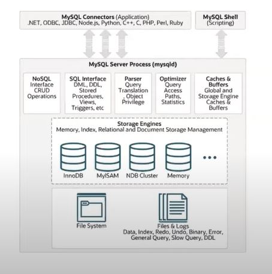

# MySql 아키텍처

MySql 아키텍처는 크게 4가지로 구분할 수 있습니다.

- __MySql 접속 클라이언트__
  - MySQL Connectors
  - MySQL Shell
  - MySQL 은 대부분의 프로그래밍 언어에 대해 접속 API 를 제공한다. 그리고 Shell 에서도 Script 를 통해 MySQL 에 접속할 수 있다.
- __MySQL 엔진__ : MySQL 의 두뇌
  - 쿼리 파서
  - 전처리기
  - 옵티마이저
    - 요청된 SQL 문을 최적화하여 실행시키기 위해 실행 계획을 짜는 중요한 역할을 한다.
    - MySQL 엔진을 두뇌에 비유한 이유는 이 옵티마이저 때문이다.
  - 실행 엔진
- __MySQL 스토리지 엔진__
  - 스토리지 엔진은 데이터를 실제로 디스크에 저장하거나, 디스크에 저장된 데이터를 읽어오는 역할을 담당한다.
  - MySQL 엔진은 옵티마이저가 작성한 실행 계획에 따라서 스토리지 엔진을 적절히 호출해서 쿼리를 실행한다.
  - MySQL 엔진이 스토리지 엔진을 호출할 때 사용하는 API 를 `핸들러 API` 라고 한다.
  - 핸들러 API 를 직접 구현하여 나만의 스토리지 엔진을 추가할 수도 있다.
- __운영체제, 하드웨어__
  - 실제 테이블의 데이터와 로그 데이터를 파일로 저장하는 역할을 담당한다.

## References

> https://www.youtube.com/watch?v=vQFGBZemJLQ&list=PLgXGHBqgT2TvpJ_p9L_yZKPifgdBOzdVH&index=3
